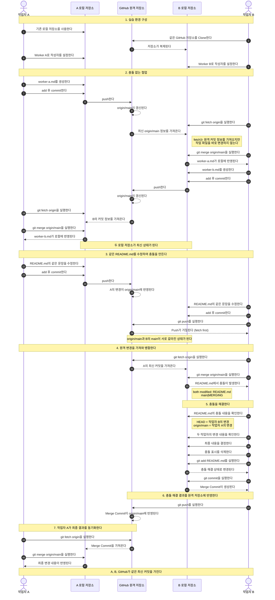
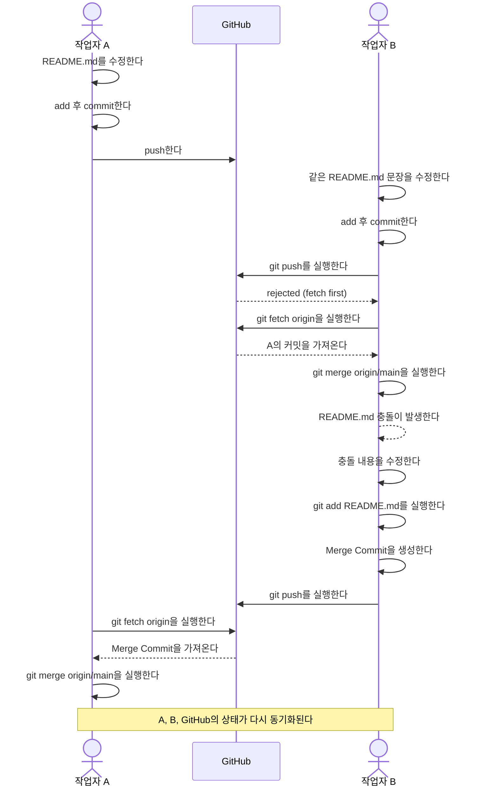

# Git 협업 실습 - Fetch, Merge 및 충돌 해결

하나의 GitHub 저장소를 두 개의 로컬 저장소에 Clone하여 작업자 A와 작업자 B가 협업하는 상황을 구성한다.

각 로컬 저장소는 같은 원격 저장소를 바라보지만 서로 독립적으로 동작한다. 따라서 다른 작업자가 Push한 변경 사항은 내 로컬 저장소에 자동으로 반영되지 않는다.

이번 실습에서는 다음 과정을 확인한다.

```text
fetch → merge → 충돌 해결 → commit → push
```

## 1. 전체 협업 흐름



## 2. 충돌 발생 과정

작업자 A와 B가 같은 `README.md`의 같은 문장을 서로 다르게 수정한다.

작업자 A가 먼저 변경 내용을 Push한다. 작업자 B는 A의 변경을 가져오지 않은 상태에서 자신의 변경 내용을 Commit한 후 Push를 시도한다.

이때 원격 저장소에는 B가 가지고 있지 않은 A의 커밋이 존재하므로 Push가 거절된다.



## 3. Push가 거절되는 이유

작업자 A와 B는 처음에는 같은 커밋을 기준으로 작업한다.

이후 A와 B가 각각 새로운 커밋을 만들면 다음과 같이 브랜치가 갈라진다.

```text
        A의 README 수정
       /
공통 커밋
       \
        B의 README 수정
```

A가 자신의 커밋을 먼저 GitHub에 Push하면 `origin/main`은 A의 커밋을 가리킨다.

하지만 B의 로컬 `main`에는 A의 커밋이 존재하지 않는다. 이 상태에서 B가 바로 Push하면 원격 저장소의 변경을 덮어쓸 가능성이 있으므로 GitHub가 Push를 거절한다.

```text
! [rejected] main -> main (fetch first)
```

따라서 B는 먼저 원격 저장소의 변경 내용을 가져와 자신의 작업과 병합해야 한다.

## 4. 원격 변경 확인

먼저 원격 저장소의 최신 커밋 정보를 가져온다.

```bash
git fetch origin
```

`fetch`를 실행해도 현재 작업 파일이나 로컬 `main`이 바로 변경되지는 않는다.

원격 저장소에만 존재하는 커밋을 확인한다.

```bash
git log --oneline main..origin/main
```

로컬 저장소에만 존재하는 커밋도 확인한다.

```bash
git log --oneline origin/main..main
```

전체 커밋 구조를 확인하려면 다음 명령을 사용한다.

```bash
git log --oneline --graph --all --decorate
```

이 시점에는 A와 B가 각각 만든 커밋이 서로 다른 방향으로 갈라져 있다.

## 5. Merge 및 충돌 확인

원격 브랜치의 내용을 현재 로컬 `main`에 병합한다.

```bash
git merge origin/main
```

두 작업자가 `README.md`의 같은 부분을 서로 다르게 수정했기 때문에 Git이 자동으로 병합하지 못하고 충돌이 발생한다.

```text
CONFLICT (content): Merge conflict in README.md
Automatic merge failed; fix conflicts and then commit the result.
```

현재 상태를 확인한다.

```bash
git status
```

충돌이 발생한 파일은 다음과 같이 표시된다.

```text
both modified: README.md
```

Merge가 진행 중인 경우 Git Bash에서 브랜치가 다음과 같이 표시될 수 있다.

```text
main|MERGING
```

## 6. 충돌 내용 확인

`README.md`를 열면 Git이 추가한 충돌 표시를 확인할 수 있다.

```text
<<<<<<< HEAD
오늘의 학습 목표: 작업자 B의 Merge 충돌 실습
=======
오늘의 학습 목표: 작업자 A의 Git 협업 실습
>>>>>>> origin/main
```

`HEAD` 부분은 현재 Merge를 수행하고 있는 작업자 B의 로컬 내용이다.

`origin/main` 부분은 작업자 A가 먼저 Push한 원격 저장소의 내용이다.

두 내용을 확인한 후 최종적으로 사용할 내용을 결정한다.

```text
오늘의 학습 목표: 작업자 A·B의 Git 협업 및 Merge 충돌 해결
```

최종 내용을 작성한 뒤 다음 충돌 표시는 모두 삭제한다.

```text
<<<<<<< HEAD
=======
>>>>>>> origin/main
```

## 7. 충돌 해결 완료

파일을 수정했다고 해서 Merge가 바로 완료되는 것은 아니다.

수정한 파일을 `add`하여 Git에 충돌이 해결되었음을 알린다.

```bash
git add README.md
```

상태를 확인한다.

```bash
git status
```

정상적으로 충돌을 해결했다면 다음과 같은 메시지를 확인할 수 있다.

```text
All conflicts fixed but you are still merging.
```

파일의 충돌은 해결되었지만 아직 Merge Commit이 만들어지지 않은 상태이다.

Merge Commit을 생성한다.

```bash
git commit -m "B: A의 변경과 README 충돌 해결"
```

다시 상태를 확인한다.

```bash
git status
```

Merge가 완료되면 `MERGING` 표시가 사라진다.

## 8. Merge 결과 Push

충돌 해결 결과를 GitHub에 반영한다.

```bash
git push
```

이제 GitHub의 `main`에는 A와 B의 작업을 병합한 Merge Commit이 존재한다.

커밋 구조는 다음과 같은 형태가 된다.

```text
*   Merge Commit
|\
| * A의 README 수정
* | B의 README 수정
|/
*   공통 커밋
```

## 9. 작업자 A의 최종 동기화

작업자 A의 로컬 저장소에는 아직 B가 생성한 Merge Commit이 존재하지 않는다.

먼저 원격 저장소의 최신 정보를 가져온다.

```bash
git fetch origin
```

원격 저장소에만 존재하는 커밋을 확인한다.

```bash
git log --oneline main..origin/main
```

Merge 결과를 A의 로컬 `main`에 반영한다.

```bash
git merge origin/main
```

최종적으로 다음 세 브랜치가 같은 최신 커밋을 가지게 된다.

```text
작업자 A의 local main
        │
        ├── 같은 최신 Commit
        │
GitHub origin/main
        │
        ├── 같은 최신 Commit
        │
작업자 B의 local main
```

## 10. 정리

같은 GitHub 저장소를 Clone하더라도 각 로컬 저장소는 서로 독립적으로 동작한다.

작업자 A가 Push해도 작업자 B의 로컬 파일이 자동으로 변경되지 않는다. 반대로 작업자 B가 Push한 내용도 작업자 A의 로컬 저장소에 자동으로 반영되지 않는다.

다른 작업자의 변경을 가져올 때는 다음 과정을 사용한다.

```text
git fetch origin
        ↓
원격 변경 확인
        ↓
git merge origin/main
```

충돌이 발생하면 다음 순서로 해결한다.

```text
충돌 파일 확인
      ↓
최종 내용으로 수정
      ↓
git add
      ↓
git commit
      ↓
git push
```

실제 작업을 시작하기 전에는 먼저 원격 저장소의 변경 여부를 확인하는 것이 좋다.

```bash
git fetch origin
git status
git log --oneline main..origin/main
```

원격에 새로운 커밋이 있다면 먼저 병합한다.

```bash
git merge origin/main
```

그다음 작업을 진행하고 Commit한 뒤 Push한다.

```bash
git add .
git commit -m "작업 내용"
git push
```

전체 흐름은 다음과 같이 정리할 수 있다.

```text
fetch
  ↓
원격 변경 확인
  ↓
merge
  ↓
파일 수정
  ↓
add
  ↓
commit
  ↓
push
```
