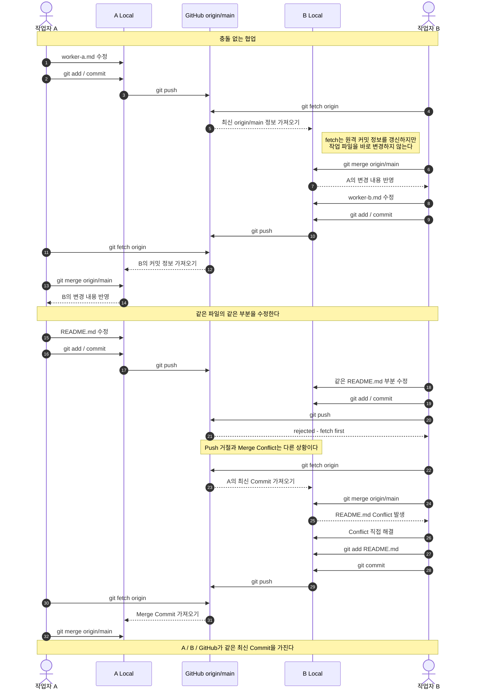

# Git 협업 실습 - Fetch, Merge 및 Conflict 해결

## 1. 실습 목적

하나의 GitHub 저장소를 두 개의 독립된 로컬 저장소에 Clone하여 두 명의 개발자가 협업하는 상황을 재현한다.

이번 실습에서는 단순히 Merge Conflict를 해결하는 것에 그치지 않고 다음 내용을 확인한다.

- 같은 원격 저장소를 Clone해도 각 로컬 저장소는 독립적으로 동작한다.
- 다른 개발자가 Push한 변경 사항은 내 로컬 저장소에 자동으로 반영되지 않는다.
- `git fetch`와 `git merge`의 역할을 구분한다.
- Push가 거절되는 상황과 Merge Conflict가 발생하는 상황을 구분한다.
- 충돌을 해결하고 Merge Commit을 생성하는 과정을 확인한다.
- 실습에서 사용한 `main` 직접 Push 방식과 실제 협업에서 사용하는 Branch / PR 방식을 비교한다.

핵심 흐름은 다음과 같다.

```text
fetch → 변경 확인 → merge → conflict 해결 → commit → push
```

---

## 2. 실습 환경

같은 GitHub 저장소를 두 개의 로컬 저장소에서 사용한다.

```text
                    GitHub
                  origin/main
                  /         \
             fetch/push   fetch/push
                /             \
       작업자 A 로컬        작업자 B 로컬
       main                 main
```

각 로컬 저장소는 동일한 `origin`을 바라보지만 다음 요소는 서로 독립적이다.

```text
Working Directory
Staging Area
Local Commit
Local main
Git Config
```

따라서 한 작업자가 파일을 수정하거나 Commit했다고 해서 다른 작업자의 로컬 저장소가 자동으로 변경되지는 않는다.

---

## 3. 전체 협업 흐름



---

## 4. 충돌 없는 협업

먼저 두 작업자가 서로 다른 파일을 수정한다.

### 작업자 A

```bash
git add worker-a.md
git commit -m "A: 작업자 A 문서 추가"
git push
```

작업자 A의 Commit이 GitHub의 `origin/main`에 반영된다.

하지만 작업자 B의 로컬 `main`에는 아직 해당 Commit이 존재하지 않는다.

작업자 B는 원격 저장소의 변경을 확인한다.

```bash
git fetch origin
```

원격 저장소에만 존재하는 Commit을 확인한다.

```bash
git log --oneline main..origin/main
```

이후 원격 변경을 로컬 `main`에 병합한다.

```bash
git merge origin/main
```

여기서 확인한 중요한 점은 `fetch`와 `merge`의 역할이 서로 다르다는 것이다.

```text
git fetch
→ 원격 저장소의 최신 Commit 정보를 가져온다.
→ 현재 작업 파일은 변경하지 않는다.

git merge origin/main
→ 가져온 origin/main의 Commit을 현재 브랜치에 병합한다.
→ 이 과정에서 실제 작업 파일이 변경될 수 있다.
```

---

## 5. 같은 파일을 수정하면 어떻게 되는가

이번에는 작업자 A와 B가 `README.md`의 같은 부분을 서로 다르게 수정한다.

두 작업자는 다음과 같은 공통 Commit에서 작업을 시작한다.

```text
             A의 README 수정
            /
공통 Commit
            \
             B의 README 수정
```

작업자 A가 먼저 Commit을 Push한다.

```bash
git add README.md
git commit -m "A: README 학습 목표 수정"
git push
```

이후 작업자 B도 자신의 변경 내용을 Commit한다.

```bash
git add README.md
git commit -m "B: README 학습 목표 수정"
```

작업자 B가 바로 Push를 시도한다.

```bash
git push
```

다음과 같이 Push가 거절된다.

```text
! [rejected] main -> main (fetch first)
```

---

## 6. Push 거절과 Merge Conflict의 차이

이번 실습에서 가장 중요하게 확인한 부분이다.

작업자 B의 `git push`가 실패한 순간에는 아직 Merge Conflict가 발생한 것이 아니다.

```text
Push 시도
   ↓
rejected (fetch first)
```

GitHub의 `origin/main`에는 작업자 A의 새로운 Commit이 존재하지만 작업자 B의 로컬 `main`에는 해당 Commit이 존재하지 않는다.

즉 다음과 같이 서로 다른 Commit을 가지고 있는 상태이다.

```text
                 A Commit ← origin/main
                /
공통 Commit
                \
                 B Commit ← B local main
```

GitHub는 원격 저장소의 변경을 보호하기 위해 B의 Push를 거절한다.

따라서 다음 두 상황을 구분한다.

```text
Push rejected
≠
Merge Conflict
```

Push가 거절된 이후 B가 원격 변경을 가져와 Merge하는 과정에서 Conflict가 발생할 수 있다.

---

## 7. 원격 변경 확인

먼저 GitHub의 최신 Commit 정보를 가져온다.

```bash
git fetch origin
```

전체 Commit 구조를 확인한다.

```bash
git log --oneline --graph --all --decorate
```

원격에만 존재하는 Commit을 확인한다.

```bash
git log --oneline main..origin/main
```

로컬에만 존재하는 Commit을 확인한다.

```bash
git log --oneline origin/main..main
```

이 과정을 통해 현재 로컬 `main`과 `origin/main`이 서로 다른 Commit을 가지고 있다는 것을 확인한다.

---

## 8. Merge Conflict 발생

원격 변경을 현재 로컬 `main`에 병합한다.

```bash
git merge origin/main
```

A와 B가 `README.md`의 같은 부분을 서로 다르게 수정했기 때문에 Git이 어느 변경을 선택해야 할지 판단할 수 없다.

따라서 다음과 같은 Conflict가 발생한다.

```text
Auto-merging README.md
CONFLICT (content): Merge conflict in README.md
Automatic merge failed; fix conflicts and then commit the result.
```

현재 상태를 확인한다.

```bash
git status
```

```text
both modified: README.md
```

Git Bash에서는 Merge가 완료되지 않은 상태를 다음과 같이 확인할 수 있다.

```text
main|MERGING
```

---

## 9. Conflict 확인

`README.md`를 확인하면 Git이 다음과 같은 표시를 추가한다.

```text
<<<<<<< HEAD
오늘의 학습 목표: 작업자 B의 Merge 충돌 실습
=======
오늘의 학습 목표: 작업자 A의 Git 협업 실습
>>>>>>> origin/main
```

각 영역의 의미는 다음과 같다.

```text
HEAD
→ 현재 Merge를 수행하고 있는 B의 변경

origin/main
→ A가 먼저 Push한 원격 저장소의 변경
```

Git은 어떤 코드가 맞는지 판단하지 않는다.

최종적으로 사용할 내용은 개발자가 직접 결정해야 한다.

이번 실습에서는 두 내용을 하나로 통합한다.

```text
오늘의 학습 목표: 작업자 A·B의 Git 협업 및 Merge 충돌 해결
```

이후 Conflict Marker를 모두 제거한다.

```text
<<<<<<< HEAD
=======
>>>>>>> origin/main
```

---

## 10. Conflict 해결 및 Merge Commit 생성

파일을 수정하는 것만으로 Merge가 완료되지는 않는다.

먼저 Git에 해당 파일의 충돌을 해결했음을 알린다.

```bash
git add README.md
```

현재 상태를 확인한다.

```bash
git status
```

정상적으로 Conflict를 해결했다면 다음 메시지를 확인할 수 있다.

```text
All conflicts fixed but you are still merging.
```

Conflict는 해결했지만 아직 Merge Commit이 생성되지 않은 상태이다.

Merge Commit을 생성한다.

```bash
git commit -m "B: A의 변경과 README 충돌 해결"
```

Commit 구조는 다음과 같이 변경된다.

```text
*   Merge Commit
|\
| * A Commit
* | B Commit
|/
*   Common Commit
```

Merge 결과를 GitHub에 Push한다.

```bash
git push
```

---

## 11. 다른 작업자의 최종 동기화

작업자 B가 Merge 결과를 Push하더라도 작업자 A의 로컬 저장소가 자동으로 변경되지는 않는다.

A는 다시 원격 저장소의 변경을 가져온다.

```bash
git fetch origin
```

원격 저장소에 존재하는 새로운 Commit을 확인한다.

```bash
git log --oneline main..origin/main
```

이후 로컬 `main`에 반영한다.

```bash
git merge origin/main
```

최종적으로 세 브랜치가 같은 Commit을 가리키게 된다.

```text
A local main
      │
      │
GitHub origin/main
      │
      │
B local main
```

---

## 12. 실습에서 이해한 Git의 동작

### 로컬 저장소는 서로 독립적이다

같은 GitHub 저장소를 Clone했더라도 각 개발자의 로컬 저장소는 독립적으로 동작한다.

```text
A local main
B local main
GitHub origin/main
```

세 브랜치는 항상 같은 Commit을 가리키는 것이 아니다.

### Fetch와 Merge는 다른 작업이다

```text
fetch
→ 원격 저장소의 최신 정보를 가져온다.

merge
→ 가져온 변경을 현재 브랜치에 반영한다.
```

`fetch`만 실행하면 작업 파일은 변경되지 않는다.

### Push 거절과 Conflict는 같은 문제가 아니다

```text
Push rejected
→ 원격에 내가 가지고 있지 않은 Commit이 존재한다.

Merge Conflict
→ 두 변경 내용을 Git이 자동으로 합치지 못한다.
```

이번 실습에서는 먼저 Push가 거절되고, 이후 `merge` 과정에서 실제 Conflict가 발생한다.

### Conflict는 Merge를 수행하는 쪽에서 해결한다

이번 실습에서는 작업자 B가 다음 명령을 실행한다.

```bash
git merge origin/main
```

따라서 B의 로컬 저장소에서 Conflict가 발생하고 B가 이를 해결한다.

해결한 Merge Commit을 Push하면 다른 작업자가 다시 해당 결과를 가져온다.

---

## 13. 실습 방식과 실제 협업 방식의 차이

이번 실습에서는 Git의 동작 원리를 확인하기 위해 작업자 A와 B가 모두 `main`에 직접 Push한다.

```text
A ────────→ main
             ↑
B ───────────┘
```

하지만 여러 개발자가 함께 작업하는 실제 프로젝트에서는 일반적으로 각 개발자가 별도의 Branch에서 작업한 뒤 Pull Request를 통해 변경 내용을 병합하는 방식을 사용한다.

```text
                     main
                   /      \
          feature/A        feature/B
             ↑                ↑
          작업자 A          작업자 B
```

일반적인 협업 흐름은 다음과 같다.

```text
Branch 생성
    ↓
코드 수정
    ↓
git add
    ↓
git commit
    ↓
작업 Branch Push
    ↓
Pull Request 생성
    ↓
Code Review
    ↓
승인
    ↓
main Merge
```

PR을 사용한다고 해서 Conflict가 발생하지 않는 것은 아니다.

두 개발자가 같은 코드를 수정했다면 PR을 Merge하는 과정에서도 Conflict가 발생할 수 있다.

PR은 Conflict 자체를 제거하는 기능이라기보다 `main`에 변경 사항을 반영하기 전에 코드 리뷰와 검증 과정을 거치도록 하는 협업 방식으로 이해한다.

---

## 14. 최종 정리

이번 실습을 통해 Git 협업에서 중요한 것은 단순히 `add → commit → push` 명령을 사용하는 것이 아니라 현재 로컬 저장소와 원격 저장소가 어떤 Commit을 가지고 있는지 이해하는 것이라는 점을 확인한다.

작업 전에는 먼저 원격 저장소의 상태를 확인한다.

```bash
git fetch origin
git status
git log --oneline main..origin/main
```

원격 저장소에 새로운 Commit이 존재한다면 이를 확인하고 현재 작업과 통합한다.

```bash
git merge origin/main
```

이후 작업을 진행한다.

```bash
git add .
git commit -m "작업 내용"
git push
```

이번 실습의 전체 흐름은 다음과 같다.

```text
원격 상태 확인
      ↓
fetch
      ↓
Commit 차이 확인
      ↓
merge
      ↓
Conflict 발생 여부 확인
      ↓
Conflict 해결
      ↓
add
      ↓
commit
      ↓
push
```

결과적으로 Git 협업에서는 누가 먼저 Push했는가보다 각 저장소의 Commit 상태를 파악하고 변경 내용을 안전하게 통합하는 과정이 중요하다.
