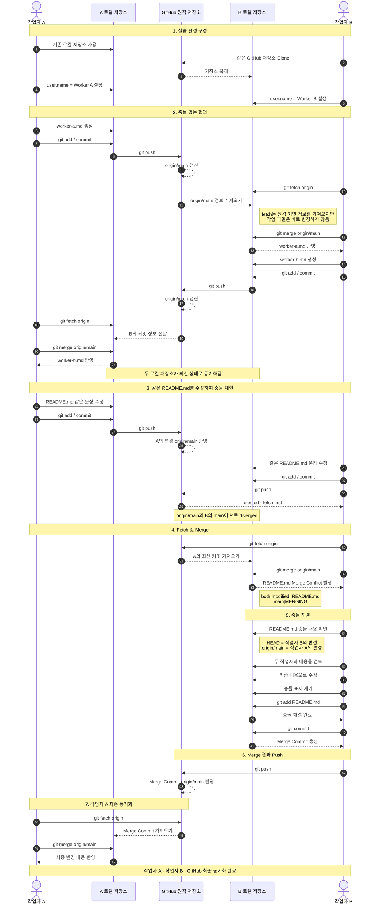
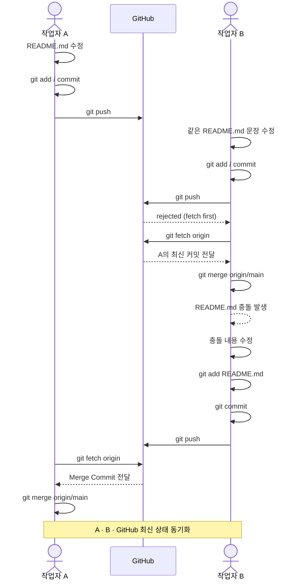

# Git 협업 실습: Fetch, Merge 및 충돌 해결

이 실습은 하나의 GitHub 저장소를 두 개의 독립된 로컬 저장소에서 사용하면서  
작업자 A와 작업자 B의 협업 과정을 재현합니다.

핵심 흐름은 다음과 같습니다.

```text
fetch → merge → 충돌 해결 → commit → push
```

## 전체 협업 흐름



## 충돌 발생 및 해결 핵심 흐름



## 충돌 해결 순서

```bash
git fetch origin
git merge origin/main
```

충돌이 발생하면 `README.md`의 충돌 표시를 확인합니다.

```text
<<<<<<< HEAD
작업자 B의 내용
=======
작업자 A의 내용
>>>>>>> origin/main
```

최종 내용을 결정한 뒤 충돌 표시를 모두 삭제합니다.

```bash
git add README.md
git commit -m "B: A의 변경과 README 충돌 해결"
git push
```

다른 작업자는 최종 Merge 결과를 다시 가져옵니다.

```bash
git fetch origin
git merge origin/main
```

## 핵심 정리

각 로컬 저장소는 같은 GitHub 저장소에 연결되어 있어도 서로 독립적입니다.

```text
작업자 A 로컬 main
작업자 B 로컬 main
GitHub origin/main
```

따라서 다른 작업자가 Push한 내용이 내 로컬 저장소에 자동으로 반영되지는 않습니다.

일반적인 협업 순서는 다음과 같습니다.

```text
git fetch origin
        ↓
원격 변경 확인
        ↓
git merge origin/main
        ↓
파일 수정
        ↓
git add
        ↓
git commit
        ↓
git push
```
